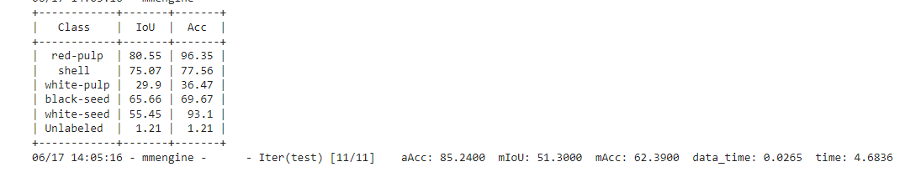
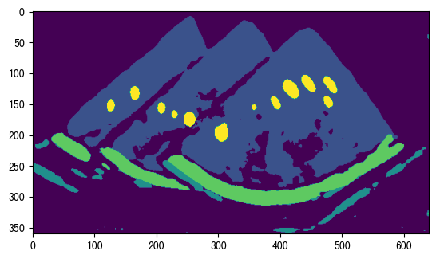
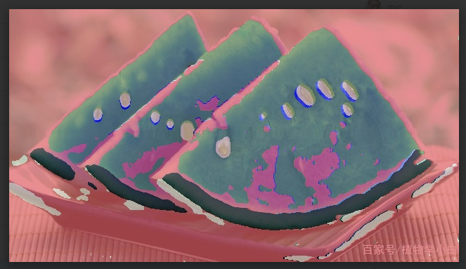

# OpenMMLab Camp 2023-02

## Assignment 4
- MMSeg 语义分割 （西瓜瓤，白皮，外壳，黑籽， 白籽）

## Checkpoint file
I share this file via google drive due to its large size and cannot be pushed to github.com

 [iter_3000.pth](https://drive.google.com/file/d/103rtx2fjEDOAhsRqRta_ObU0MjFE3ghO/view?usp=sharing)

## Test example

