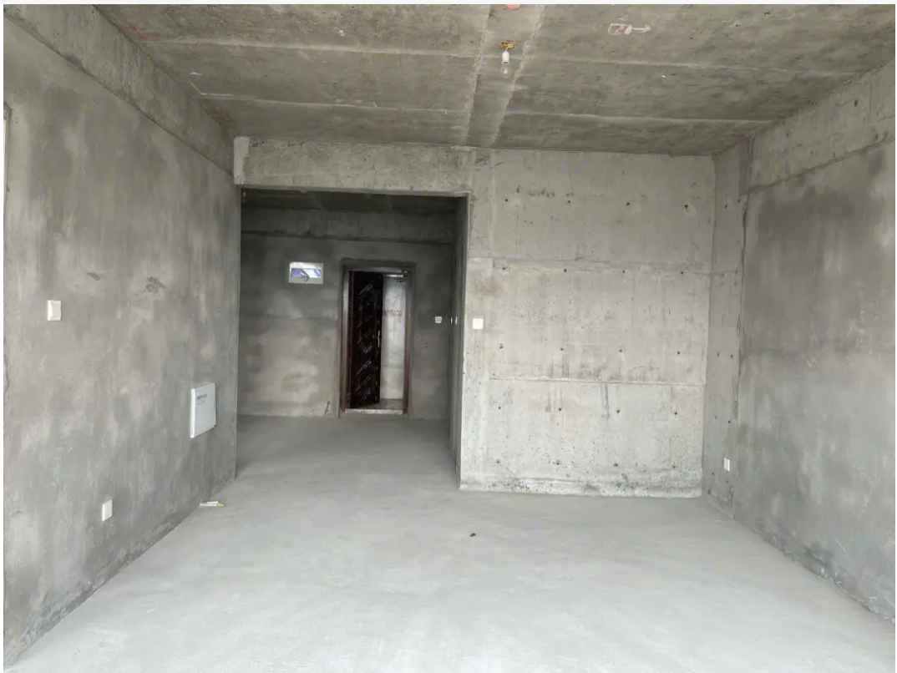
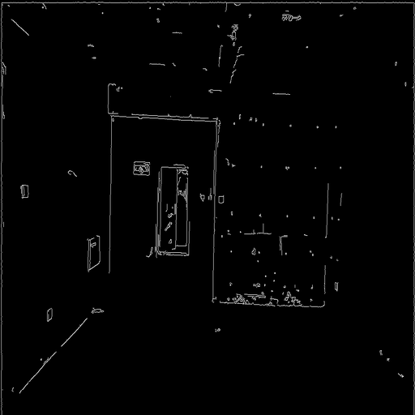
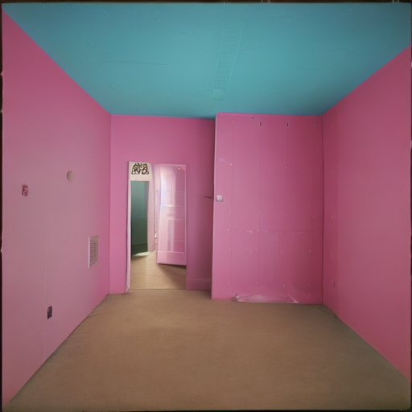
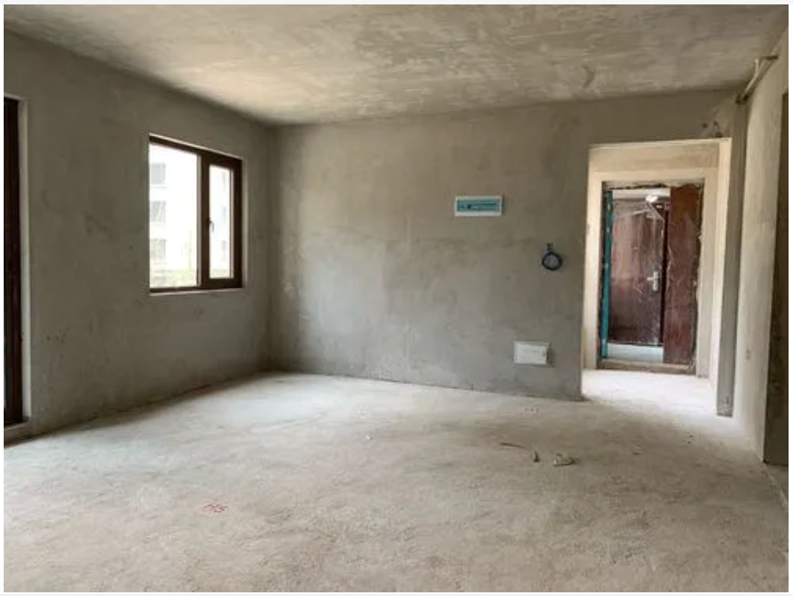
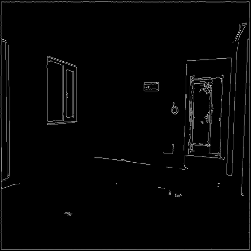
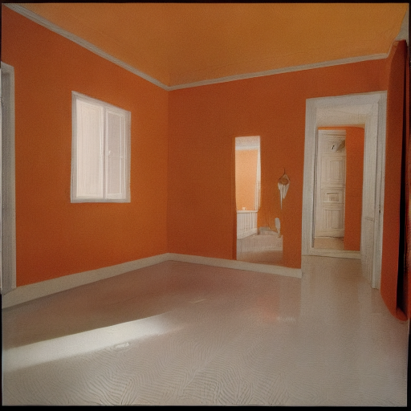

# OpenMMLab Camp 2023-02

## Assignment 5
- 基于ControlNet的毛坯房效果生成图

1. 首先根据原图生成边缘检测图
2. 设定Prompt,即一段描述毛坯房装修后的样子
3. 根据Prompt提示和第一步的Canny图，使用ControlNet生成所想要的图

## Example 1
- The original Image

- Canny Image

- Prompt

Room with pink walls, an blue ceiling.

- Output

## Example 2
- The original Image

- Canny Image

- Prompt

Room with white walls, an orange ceiling and golden floor.

- Output

